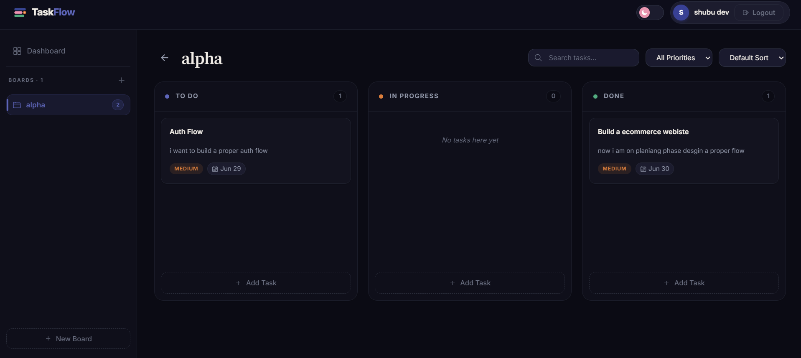

<div align="center">

<!-- ============================================================
     ANIMATED HERO BANNER
     ============================================================ -->


<!-- Animated typing headline -->
<a href="https://github.com/your-username/task-flow">
  
</a>

<br/>

<!-- Animated glowing divider -->


<br/>

<!-- Tech badges — animated on hover via shields.io style=for-the-badge -->
<p>
  
  
  
  
  
  
</p>

<p>
  
  
  
  
</p>

<!-- Animated glowing divider -->


</div>

<br/>

<!-- ============================================================
     ABOUT SECTION with animated border-style card
     ============================================================ -->

<div align="center">

### 🌟 What is TaskFlow?

</div>

> **TaskFlow** is a full-stack Kanban-style productivity app where you create boards, move tasks across **Todo → In Progress → Done** columns with drag & drop, and let **Google Gemini AI** estimate effort size and suggested due dates — wrapped in a polished, responsive UI with dark mode support and social login.

<br/>

<!-- ============================================================
     ANIMATED FEATURE GRID
     ============================================================ -->

<div align="center">


## ✨ Features


</div>

<br/>

<table align="center">
  <tr>
    <td align="center" width="200">
      <br/>
      <sub>Todo · In Progress · Done columns with per-board task counts</sub>
    </td>
    <td align="center" width="200">
      <br/>
      <sub>Smooth reordering across columns powered by @dnd-kit</sub>
    </td>
    <td align="center" width="200">
      <br/>
      <sub>One-click Gemini AI effort sizing & due date suggestions</sub>
    </td>
  </tr>
  <tr>
    <td align="center" width="200">
      <br/>
      <sub>Email/password · Google · GitHub login</sub>
    </td>
    <td align="center" width="200">
      <br/>
      <sub>System-aware theme with persistent toggle</sub>
    </td>
    <td align="center" width="200">
      <br/>
      <sub>Per-board progress charts via Recharts</sub>
    </td>
  </tr>
  <tr>
    <td align="center" width="200">
      <br/>
      <sub>Mobile, tablet & desktop layouts</sub>
    </td>
    <td align="center" width="200">
      <br/>
      <sub>Celebration animation when tasks are completed</sub>
    </td>
    <td align="center" width="200">
      <br/>
      <sub>Lightning-fast HMR dev experience</sub>
    </td>
  </tr>
</table>

<br/>

<!-- ============================================================
     SCREENSHOTS
     ============================================================ -->

<div align="center">


## 📸 Screenshots


</div>

<br/>

<table>
  <tr>
    <td align="center">
      <strong>🏠 Landing Page</strong>
    </td>
    <td align="center">
      <strong>🔐 Login Page</strong>
    </td>
  </tr>
  <tr>
    <td>
      
    </td>
    <td>
      
    </td>
  </tr>
  <tr>
    <td align="center">
      <strong>📊 Dashboard</strong>
    </td>
    <td align="center">
      <strong>📱 Mobile View</strong>
    </td>
  </tr>
  <tr>
    <td>
      
    </td>
    <td>
      
    </td>
  </tr>
</table>

<br/>

<!-- ============================================================
     PROJECT STRUCTURE
     ============================================================ -->

<div align="center">


## 🗂️ Project Structure


</div>

<br/>

```
📦 Task-Flow/
│
├── 🎨 client/                          # React frontend (Vite)
│   ├── 📁 public/                      # Static assets (favicon, images)
│   └── 📁 src/
│       ├── 📡 api/
│       │   ├── ai.js                   # AI suggestion endpoint
│       │   ├── auth.js                 # Login · Register · OAuth
│       │   ├── axios.js                # Axios instance + interceptors
│       │   ├── boards.js               # Board CRUD
│       │   └── tasks.js                # Task CRUD
│       ├── 🧩 components/
│       │   ├── Auth/ProtectedRoute.jsx
│       │   ├── Layout/                 # Layout · Navbar · Sidebar
│       │   ├── Task/TaskModal.jsx      # Create/edit task + AI button
│       │   └── UI/                     # Modal · Toast · Skeleton · ThemeToggle
│       ├── 🌐 context/
│       │   ├── AuthContext.jsx         # Global auth state
│       │   └── ThemeContext.jsx        # Global theme state
│       ├── 🪝 hooks/
│       │   ├── useAuth.js
│       │   └── useTheme.js
│       ├── 📄 pages/
│       │   ├── Landing.jsx             # Public marketing page
│       │   ├── Login.jsx / Register.jsx
│       │   ├── Dashboard.jsx           # Board list + stats
│       │   ├── BoardView.jsx           # Kanban + drag & drop
│       │   └── OAuthCallback.jsx       # OAuth token handler
│       ├── App.jsx                     # Router + provider tree
│       └── index.css                   # CSS variables + base styles
│
└── ⚙️  server/                          # Express backend (Node.js)
    ├── 🔧 config/
    │   ├── db.js                       # MongoDB connection
    │   └── passport.js                 # Google & GitHub OAuth
    ├── 🎮 controllers/
    │   ├── aiController.js             # POST /api/ai/suggest
    │   ├── authController.js           # Register · Login · OAuth
    │   ├── boardController.js          # Board CRUD
    │   └── taskController.js           # Task CRUD + reorder
    ├── 🛡️  middleware/
    │   ├── auth.js                     # JWT verification
    │   ├── errorHandler.js             # Global error handler
    │   └── validate.js                 # Joi validation
    ├── 🗄️  models/
    │   ├── User.js                     # User (local + OAuth)
    │   ├── Board.js                    # Board schema
    │   └── Task.js                     # Task (status · priority · effort)
    ├── 🛣️  routes/                       # Express route definitions
    ├── 🤖 services/aiService.js         # Gemini API + fallback logic
    ├── server.js                       # App entry point
    └── .env.example
```

<br/>

<!-- ============================================================
     TECH STACK
     ============================================================ -->

<div align="center">


## 🛠️ Tech Stack


</div>

<br/>

<div align="center">

### 🎨 Frontend

| Technology | Version | Purpose |
|:---:|:---:|:---|
|  | 19 | UI framework |
|  | 8 | Build tool & HMR dev server |
|  | v7 | Client-side routing |
|  | 6 | Drag-and-drop Kanban columns |
|  | 3 | Task progress charts |
|  | 1 | HTTP client |
|  | 5 | Icon library |
|  | 1 | Task completion celebration 🎉 |

### ⚙️ Backend

| Technology | Version | Purpose |
|:---:|:---:|:---|
|  | 18+ | Runtime |
|  | 4 | REST API framework |
|  | — | Document database |
|  | 8 | MongoDB ODM |
|  | 9 | Stateless auth tokens |
|  | 2 | Password hashing |
|  | 0.7 | Google & GitHub OAuth |
|  | 17 | Request validation |
|  | 1 | AI SDK |

</div>

<br/>

<!-- ============================================================
     AI SECTION
     ============================================================ -->

<div align="center">


## 🤖 AI Feature — Google Gemini


</div>

<br/>

### Why Gemini?

Google Gemini (`@google/genai`) was chosen for three reasons:

| Reason | Detail |
|:---|:---|
| 🧱 **Structured JSON output** | SDK supports `responseMimeType: 'application/json'` + `responseSchema` — no regex parsing needed |
| 🆓 **Free tier** | Gemini 1.5 Flash & 2.0 Flash work on the free tier at [aistudio.google.com](https://aistudio.google.com) — no billing required |
| 🔄 **Model fallback chain** | Tries `gemini-2.0-flash` → `gemini-1.5-flash` → `gemini-1.5-flash-8b` automatically on quota errors |

### How it works

```
User clicks "AI Suggest" in Task Modal
        │
        ▼
POST /api/ai/suggest  { title, description }
        │
        ▼
 aiService.js  ──►  Google Gemini API
        │                   │
        │         Returns structured JSON:
        │         { effort, estimatedHours,
        │           suggestedDueDate, reasoning }
        │
        ▼
  Validate & sanitize response
        │
        ▼
  Auto-fill modal fields  ──►  User accepts or edits  ──►  Save task
        │
   (if API fails)
        ▼
  Fallback mock estimate based on task title length
  (app never hard-fails)
```

**Response fields:**
- `effort` → `S` / `M` / `L`  *(Small / Medium / Large)*
- `estimatedHours` → integer hours
- `suggestedDueDate` → `YYYY-MM-DD`
- `reasoning` → brief AI explanation

<br/>

<!-- ============================================================
     LOCAL SETUP
     ============================================================ -->

<div align="center">


## ⚙️ Local Setup


</div>

<br/>

### Prerequisites

<table>
<tr>
<td>

- [Node.js](https://nodejs.org) **v18+**
- [npm](https://npmjs.com) **v9+**
- [MongoDB Atlas](https://cloud.mongodb.com) free cluster **or** local MongoDB

</td>
<td>

- [Gemini API key](https://aistudio.google.com/app/apikey) *(free, no billing)*
- Google OAuth app *(optional)*
- GitHub OAuth app *(optional)*

</td>
</tr>
</table>

---

### Step 1 — Clone

```bash
git clone https://github.com/your-username/task-flow.git
cd task-flow
```

---

### Step 2 — Backend setup

```bash
cd server
npm install
cp .env.example .env
```

Edit `server/.env`:

```env
# ── Database ────────────────────────────────────────────────────
MONGODB_URI=mongodb+srv://<user>:<password>@<cluster>.mongodb.net/taskflow

# ── Auth ────────────────────────────────────────────────────────
JWT_SECRET=your_super_secret_jwt_key_here
JWT_EXPIRES_IN=7d
SESSION_SECRET=your_session_secret_here

# ── AI ──────────────────────────────────────────────────────────
GEMINI_API_KEY=your_gemini_api_key_here   # aistudio.google.com/app/apikey

# ── OAuth (optional) ────────────────────────────────────────────
GOOGLE_CLIENT_ID=your_google_client_id
GOOGLE_CLIENT_SECRET=your_google_client_secret
GITHUB_CLIENT_ID=your_github_client_id
GITHUB_CLIENT_SECRET=your_github_client_secret

# ── URLs ────────────────────────────────────────────────────────
CLIENT_URL=http://localhost:5173
```

> OAuth credentials are **optional** — email/password auth and all other features work without them.

```bash
npm run dev
# ✅ API running at http://localhost:5000/api
# ✅ Health check: http://localhost:5000/api/health
```

---

### Step 3 — Frontend setup

```bash
# in a new terminal
cd client
npm install
npm run dev
# ✅ App running at http://localhost:5173
```

> Vite proxies all `/api` calls to `http://localhost:5000` — no extra CORS config needed locally.

---

### Step 4 — OAuth redirect URIs *(optional)*

Add these in your OAuth app dashboards:

| Provider | Callback URL |
|:---|:---|
| **Google** | `http://localhost:5000/api/auth/google/callback` |
| **GitHub** | `http://localhost:5000/api/auth/github/callback` |

<br/>

<!-- ============================================================
     ENV REFERENCE
     ============================================================ -->

<div align="center">


## 🔑 Environment Variables


</div>

<br/>

| Variable | Required | Description |
|:---|:---:|:---|
| `MONGODB_URI` | ✅ | MongoDB Atlas connection string |
| `JWT_SECRET` | ✅ | Secret for signing JWT tokens |
| `JWT_EXPIRES_IN` | ✅ | Token lifetime e.g. `7d` |
| `GEMINI_API_KEY` | ✅ | Google Gemini API key |
| `SESSION_SECRET` | ✅ | Passport OAuth session secret |
| `CLIENT_URL` | ✅ | Frontend origin for OAuth redirects |
| `GOOGLE_CLIENT_ID` | ⬜ | Google OAuth client ID |
| `GOOGLE_CLIENT_SECRET` | ⬜ | Google OAuth client secret |
| `GITHUB_CLIENT_ID` | ⬜ | GitHub OAuth client ID |
| `GITHUB_CLIENT_SECRET` | ⬜ | GitHub OAuth client secret |

<br/>

<!-- ============================================================
     API ENDPOINTS
     ============================================================ -->

<div align="center">


## 📡 API Endpoints


</div>

<br/>

<details>
<summary><strong>🔐 Auth</strong></summary>

| Method | Endpoint | Auth | Description |
|:---:|:---|:---:|:---|
| `POST` | `/api/auth/register` | — | Create account |
| `POST` | `/api/auth/login` | — | Email/password login |
| `GET` | `/api/auth/google` | — | Start Google OAuth |
| `GET` | `/api/auth/github` | — | Start GitHub OAuth |
| `GET` | `/api/auth/me` | 🔒 JWT | Get current user |

</details>

<details>
<summary><strong>📋 Boards</strong></summary>

| Method | Endpoint | Auth | Description |
|:---:|:---|:---:|:---|
| `GET` | `/api/boards` | 🔒 JWT | List all boards |
| `POST` | `/api/boards` | 🔒 JWT | Create a board |
| `PUT` | `/api/boards/:id` | 🔒 JWT | Update a board |
| `DELETE` | `/api/boards/:id` | 🔒 JWT | Delete board + all tasks |

</details>

<details>
<summary><strong>✅ Tasks</strong></summary>

| Method | Endpoint | Auth | Description |
|:---:|:---|:---:|:---|
| `GET` | `/api/boards/:id/tasks` | 🔒 JWT | List tasks for a board |
| `POST` | `/api/boards/:id/tasks` | 🔒 JWT | Create a task |
| `PUT` | `/api/boards/:id/tasks/:taskId` | 🔒 JWT | Update a task |
| `DELETE` | `/api/boards/:id/tasks/:taskId` | 🔒 JWT | Delete a task |

</details>

<details>
<summary><strong>🤖 AI</strong></summary>

| Method | Endpoint | Auth | Description |
|:---:|:---|:---:|:---|
| `POST` | `/api/ai/suggest` | 🔒 JWT | Get AI effort estimate |

</details>

<br/>

<!-- ============================================================
     FOOTER
     ============================================================ -->

<div align="center">


<br/>

**Built with ❤️ using React, Express & Google Gemini**

<br/>


<br/><br/>


</div>
